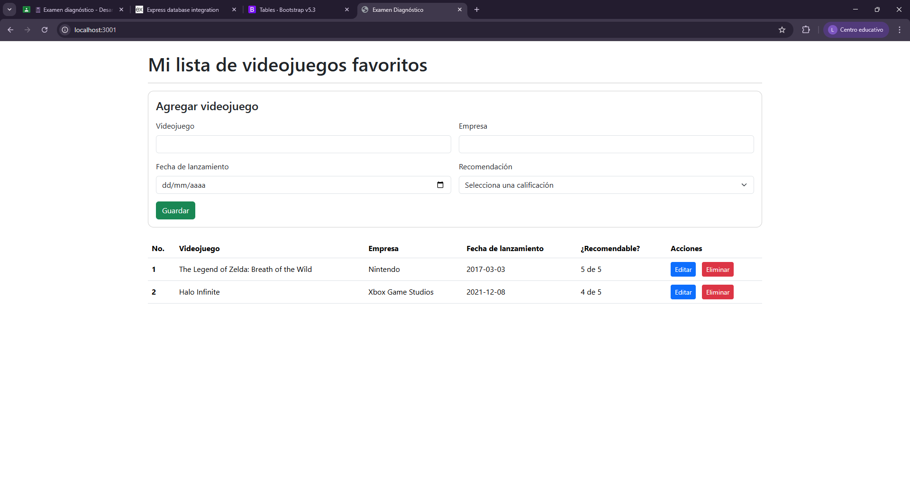
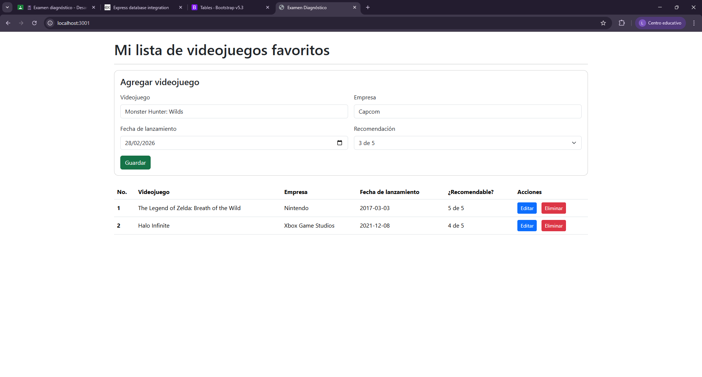
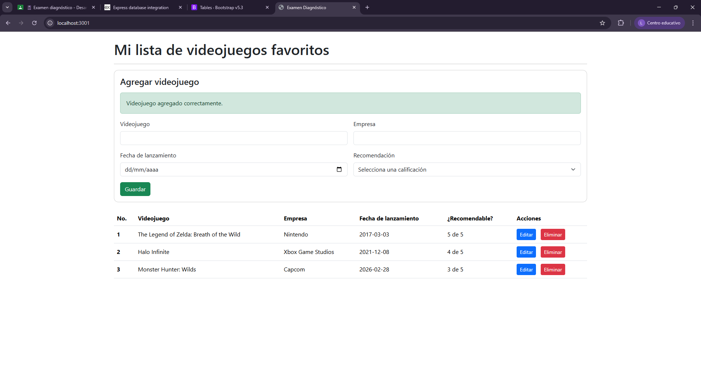
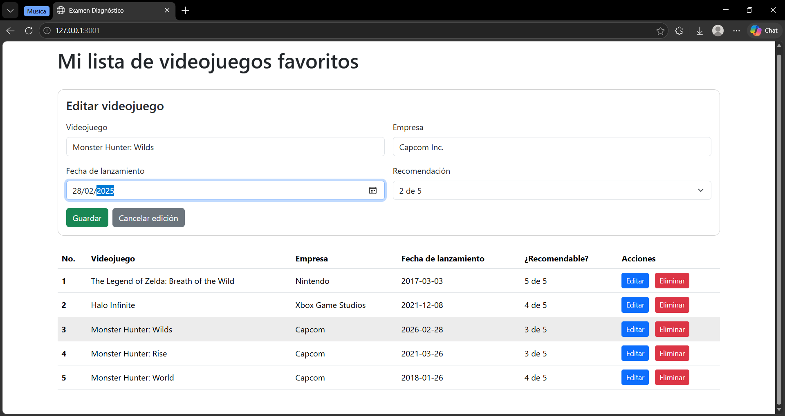
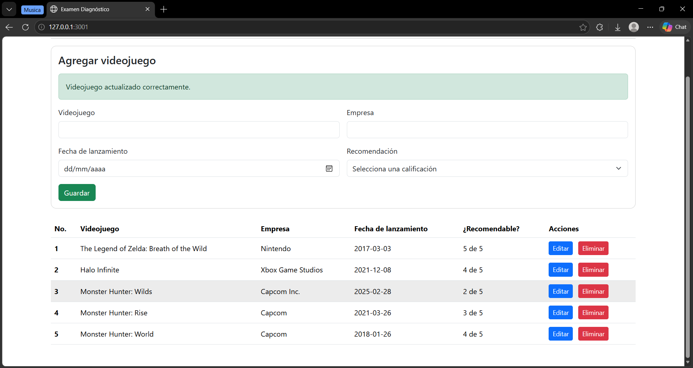
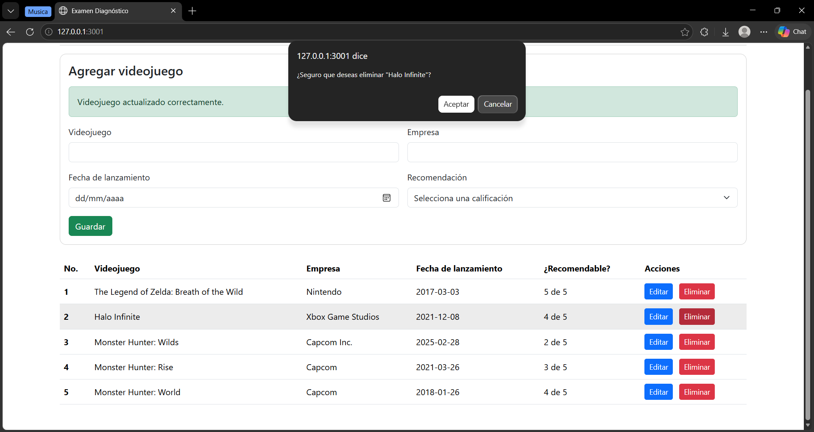
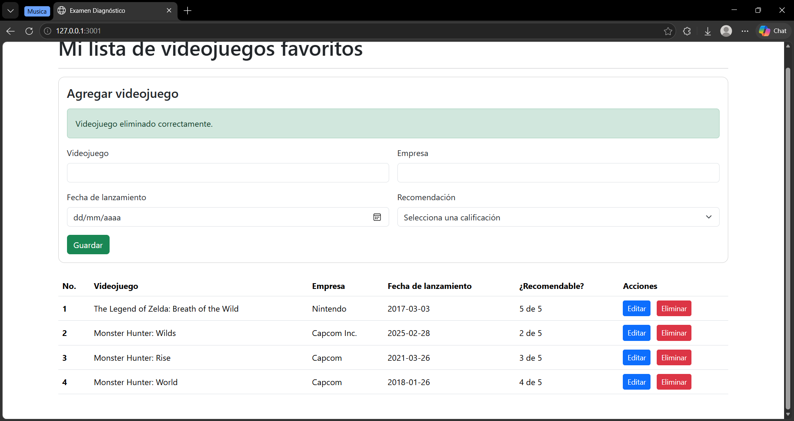
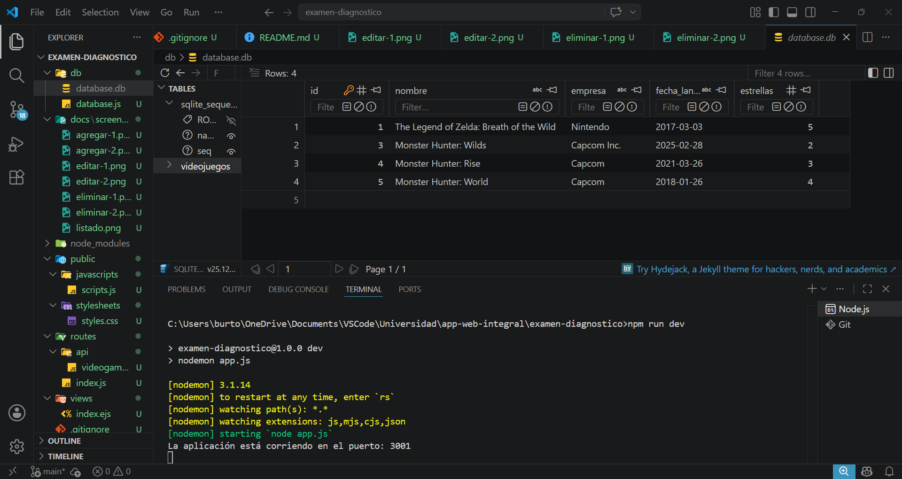

# Examen Diagnóstico - CRUD de Videojuegos

## Nombre del proyecto
Examen Diagnóstico - Aplicación Web Integral (CRUD de Videojuegos).

## Descripción
Este proyecto es una aplicación web desarrollada con Node.js y Express que permite gestionar una lista de videojuegos favoritos mediante operaciones CRUD (Crear, Leer, Actualizar y Eliminar).

La aplicación incluye:
- Interfaz web con formulario y tabla para administración de datos.
- API REST para manejar los registros de videojuegos.
- Persistencia de datos local con SQLite.

## Tecnologías utilizadas
- Node.js
- Express
- EJS (motor de plantillas)
- SQLite3
- Bootstrap 5
- JavaScript (frontend y backend)

## Funcionalidades
- Listar videojuegos registrados.
- Agregar un nuevo videojuego.
- Editar un videojuego existente.
- Eliminar un videojuego con confirmación.
- Validaciones básicas en frontend y backend:
  - Campos obligatorios (nombre, empresa, fecha de lanzamiento).
  - Calificación entre 1 y 5.
- Mensajes de éxito y error en la interfaz.

## Instrucciones para ejecutar el proyecto
### 1. Requisitos previos
- Tener instalado Node.js (recomendado v18 o superior).

### 2. Instalar dependencias
Ejecuta en la raíz del proyecto:

```bash
npm install
```

### 3. Ejecutar el proyecto
Modo normal:

```bash
npm start
```

Modo desarrollo (con recarga automática):

```bash
npm run dev
```

### 4. Abrir en navegador
Ir a:

```text
http://localhost:3001
```

## Evidencias o capturas de pantalla

```md








```

## Uso de IA
Sí, se utilizó IA como apoyo durante el desarrollo.

Uso específico:
- Apoyo para estructurar y completar el CRUD.
- Revisión de validaciones en frontend y backend.
- Asistencia para redactar y organizar esta documentación (README).

La implementación final fue revisada y adaptada al contexto del proyecto antes de su entrega.
